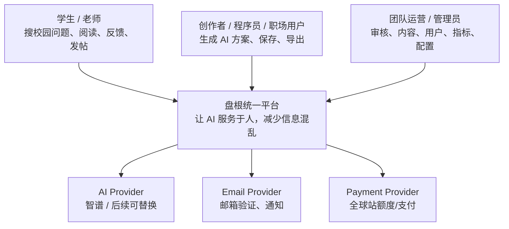
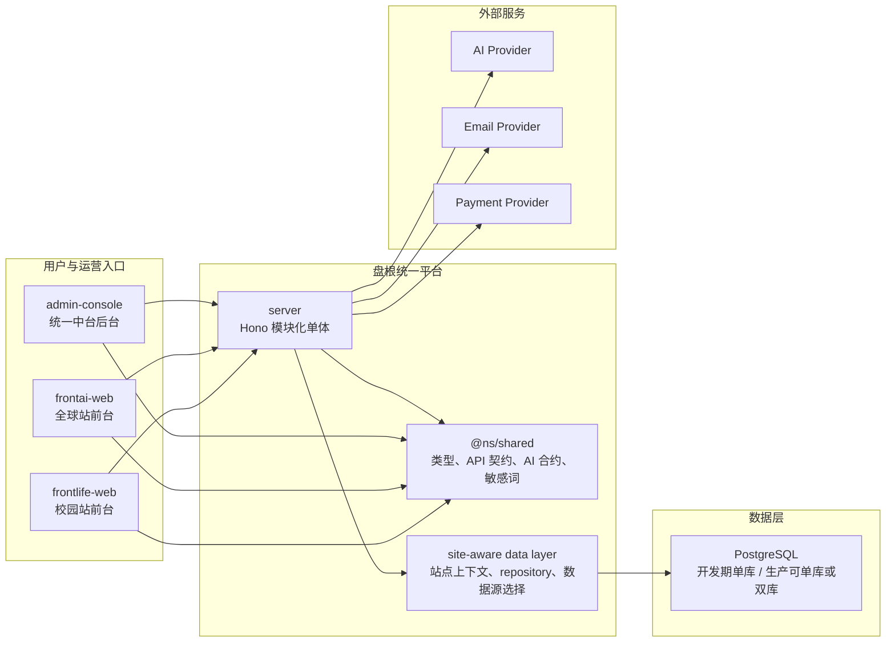
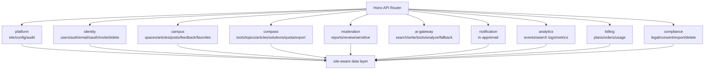
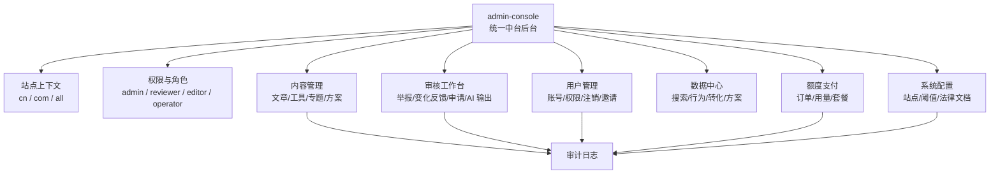

# 盘根统一平台架构研讨会：三位架构师方案与最终设计图

> 日期：2026-04-24
> 目标：为完成校园站 PRD 与全球站 PRD 全量研发任务，敲定统一平台架构设计图
> 会议方式：风格化架构研讨，不代表任何真实人物实际发言
> 最高约束：服务人的幸福，减少用户、运营者、开发者的混乱
> 工程约束：没有显性要求时，尽量不要写兼容代码

---

## 一、三位架构师选择

这次不选“最有名”的架构师，而选最适合盘根当前问题的三种架构能力。

### 1. Christopher Alexander 视角：主导

选择原因：

- 盘根的最终目标不是技术系统，而是让人的生活更有序、更少重复、更可信。
- 校园站和全球站都不是单纯工具，都是“让知识、行动、信任形成生活结构”。
- 他适合主导“系统是否让人更轻松、更自由、更有能力”的审理。

负责问题：

- 架构是否减少人的负担？
- 统一平台是否形成活的结构，而不是僵硬系统？
- 用户、作者、运营、开发者的路径是否自然？

### 2. Martin Fowler 视角：软件架构与领域边界

选择原因：

- 当前最关键的工程形态是统一后端、统一中台后台、统一数据模型。
- 需要避免过早微服务，也避免无边界混乱单体。
- 需要用模块化单体、领域边界、演进式架构完成全量 PRD。

负责问题：

- 单后端如何不变成大泥球？
- 二站共享哪些能力，不共享哪些产品面？
- 数据模型如何统一但不混乱？

### 3. Simon Brown 视角：架构表达与 C4 设计图

选择原因：

- 盘根现在不缺“想法”，缺一张所有人都能对齐的架构图。
- 全量 PRD 研发需要让前端、后端、后台、数据、AI、审核、合规都在同一张图里。
- C4 风格能把系统从上下文、容器、组件三层讲清楚。

负责问题：

- 架构图是否足够清晰？
- 模块边界是否可沟通？
- 每条用户路径是否能从前台走到后端和数据库？

---

## 二、主导架构师开场

Christopher Alexander 视角开场：

> 一个系统如果只是把代码组织得整齐，但没有让人的生活变得更轻，它不是好的架构。

盘根的架构必须回答四个问题：

1. 学生是否更容易找到可信答案？
2. 创作者是否更容易把经验沉淀成内容？
3. 运营者是否更容易处理反馈、审核和数据？
4. 开发者是否更容易继续开发，而不是被历史路径拖住？

所以本次架构会议不以“拆得多不多”作为标准，而以“是否减少混乱”作为标准。

---

## 三、三位架构师各自方案

## 3.1 Christopher Alexander 方案：生活结构优先

### 方案核心

盘根应该被设计成一个统一平台，而不是两个彼此分裂的产品。

但统一的不是用户界面，而是人的问题被处理的方式：

- 有问题：搜索。
- 有可信答案：阅读。
- 没有答案：求助或 AI 兜底。
- 内容不准：反馈变化。
- 信息需要治理：进入统一后台。
- 用户想掌握 AI：自然进入全球站。

### 架构主张

```text
两个前台，是因为用户场景不同。
一个平台，是因为使命和能力相同。
```

校园站和全球站不应共用一个前台壳，但必须共享：

- 账号能力
- 审核能力
- AI 网关
- 通知能力
- 内容治理能力
- 行为分析能力
- 合规能力
- 后台操作能力

### 他反对的设计

- 两个后台：会让运营人员重复工作。
- 两套账号：会让用户成长路径断裂。
- 两套内容审核：会让风险处理不一致。
- 两套数据模型：会让未来分析和转化断裂。
- 旧接口长期兼容：会让系统保留错误路径。

### 他的最终建议

主结构：

```text
frontlife-web + frontai-web + admin-console
        -> server
        -> site-aware data layer
        -> PostgreSQL
```

---

## 3.2 Martin Fowler 方案：统一模块化单体

### 方案核心

采用模块化单体，而不是微服务。

原因：

- 两站共用大量能力，拆微服务会制造额外复杂度。
- 当前团队需要快速完成 PRD，不需要分布式系统成本。
- 模块化单体能保留单后端效率，同时通过领域边界防止混乱。

### 后端模块划分

```text
server
  platform
    site
    config
    audit
  identity
    users
    auth
    invite
    oauth
    account-deletion
  campus
    spaces
    articles
    posts
    feedbacks
    favorites
  compass
    tools
    topics
    solutions
    quotas
    exports
  moderation
    reports
    review-tasks
    sensitive-check
  ai-gateway
    search
    write
    tools
    analyze
    fallback
  notification
    in-app
    email
  analytics
    behavior-events
    search-logs
    metrics
  billing
    plans
    orders
    usage
  compliance
    legal-documents
    user-consents
    data-export
    data-deletion
```

### 数据原则

- 一套 schema。
- 每张跨站业务表必须有 `site` 或明确站点归属。
- 所有查询经过 `site-aware data layer`。
- 后台跨站查询必须显式授权。
- 开发期单库。
- 生产期可配置：单库逻辑隔离或双库物理隔离。

### 他反对的设计

- 为旧 API 写兼容层。
- 前端绕过 shared 契约直接拼接口。
- 后台直接查表，不走领域服务。
- 两站各自实现 AI、通知、审核。

### 他的最终建议

后端先统一能力，再让两个前台和一个后台接入。

开发顺序：

1. `platform + identity + site-aware data layer`
2. `moderation + compliance`
3. `campus`
4. `compass`
5. `billing + analytics`

---

## 3.3 Simon Brown 方案：用 C4 图固定共识

### 方案核心

架构必须能被画清楚。画不清楚，说明边界还没想清楚。

Simon Brown 视角要求输出三层图：

1. System Context：盘根和外部人的关系。
2. Container：两个前台、一个后台、一个后端、数据库和外部服务。
3. Component：后端模块边界。

### 他反对的设计

- 只有口头共识，没有架构图。
- 一个“server”盒子承载所有含义。
- 后台、AI、审核、合规没有明确入口。
- 数据库图里没有 site 边界。

### 他的最终建议

所有后续 PRD 任务必须能落到架构图上的一个容器和一个模块。

如果一个任务落不下去：

- 要么架构图缺模块；
- 要么这个任务不是当前 PRD 必需；
- 要么任务定义不清楚。

---

## 四、讨论

### 4.1 是否一个数据库

Christopher Alexander：

> 用户不关心你有几个数据库。用户关心他的数据是否安全、答案是否可信、系统是否少制造麻烦。

Martin Fowler：

> 一个逻辑数据模型是必要的。一个物理数据库可以作为默认开发形态，但不能让代码假设永远只有一个库。

Simon Brown：

> 图上应画成 `site-aware data layer -> PostgreSQL deployment`，而不是直接让所有模块随便连数据库。

结论：

> 一套 schema，一套 migration，一套 data layer。开发期单 PostgreSQL；生产部署可单库或双库，但代码不分叉。

### 4.2 是否一个后台

三方一致赞成。

原因：

- 后台服务的是团队，不是用户前台品牌。
- 团队不应在两个后台之间切换处理审核、用户、内容、配置、指标。
- 统一后台能减少误处理，但必须有站点上下文和审计。

结论：

> 建立 `admin-console`，统一处理校园站和全球站后台任务。

### 4.3 是否两个前台

三方一致赞成保留两个前台。

原因：

- 校园站是生活工具，移动优先、低干扰。
- 全球站是 AI 工作流产品，需要更强的浏览、生成、保存和导出。
- 统一前台会让两个产品都失去清晰性。

结论：

> 用户前台分开，平台能力统一。

### 4.4 是否写兼容代码

三方一致反对默认兼容。

结论：

> 新模块直接接目标接口。旧接口是待删除对象，不是设计约束。

允许例外：

- 数据迁移
- 外部公开 API
- 用户已经依赖的公开路径
- 法规要求的历史留存

---

## 五、Cat Wu 产品经理审理

Cat Wu 提出问题：

1. 这张架构图能否支撑校园 PRD 全量？
2. 这张架构图能否支撑全球 PRD 全量？
3. 用户从校园站到全球站的路径是否自然？
4. 后台运营是否只需要一个入口？
5. 每个 PRD 模块是否能映射到一个后端模块？
6. 如果不写兼容代码，迁移期间谁负责删除旧路径？
7. 统一账号是否会让用户误以为两站数据互通？
8. AI 结果和人工确认内容是否有清晰边界？

Cat Wu 裁定：

> 这套架构可以作为全量 PRD 研发底图。下一步计划必须从架构图反推任务，而不是从页面列表反推任务。

产品要求：

- 账号统一能力，但两站登录态和授权上下文清晰。
- 后台统一入口，但操作时必须显示当前站点上下文。
- AI 统一网关，但前台必须明确标注 AI 输出。
- 搜索无结果、举报、变化反馈都必须进入后台可处理流程。

---

## 六、Tim Cook 旁观审理

Cook 提出问题：

1. 用户是否能清楚知道自己在哪个站使用服务？
2. 用户是否能查看、删除、导出自己的数据？
3. 统一后台是否会导致跨站误操作？
4. 审计记录是否覆盖管理员操作？
5. 隐私政策和用户协议是否按站点版本管理？
6. AI 是否永远不会伪装成人工确认内容？

Cook 裁定：

> 统一平台可以成立，但必须让边界更清楚，而不是更模糊。

加入最终设计：

- `legal_documents` 按 `site` 和 `version` 管理。
- `user_consents` 记录用户同意版本。
- `audit_logs` 记录所有后台操作。
- `admin-console` 顶部固定显示当前 `site`。
- 删除账号走 `compliance` 模块，不由各业务模块自行处理。

---

## 七、Elon Musk 旁观审理

Musk 提出问题：

1. 这张图能不能让 4 条开发线并行？
2. 哪个模块先做能最快证明统一平台正确？
3. 如果 30 天后还没完成，最大阻塞是什么？
4. 旧接口不兼容会不会加快速度？
5. 哪些模块现在就该砍掉？

Musk 裁定：

> 最大风险不是架构不够完整，而是继续讨论太久。先做 `platform + identity + admin-console + site-aware data layer`，它们会证明统一平台是否成立。

他建议砍掉或延后：

- 复杂支付套餐
- 大型数据看板
- App/小程序
- 高级推荐算法
- 复杂多组织权限

保留：

- 账号
- 审核
- 合规
- AI 网关
- 内容/方案主路径
- 行为事件

---

## 八、最终架构设计图

### 8.1 C4 Level 1：System Context



### 8.2 C4 Level 2：Container



### 8.3 C4 Level 3：Server Components



### 8.4 Admin Console 模块图



---

## 九、最终敲定方案

最终架构名：

> 盘根统一平台架构

最终结构：

```text
frontlife-web      校园站用户前台
frontai-web        全球站用户前台
admin-console      统一中台后台
server             统一模块化后端
@ns/shared         统一契约包
site-aware DAL     统一数据访问层
PostgreSQL         开发期单库，生产可单库或双库
AI Provider        后端统一代理
Email Provider     邮箱验证与通知
Payment Provider   全球站额度与支付
```

最终原则：

1. 人的幸福优先：所有模块必须减少某类人的混乱。
2. 用户前台分开：校园站和全球站场景不同。
3. 平台能力统一：后端、后台、数据模型、AI、审核、合规统一。
4. 数据边界清晰：所有跨站数据访问经过 `site-aware data layer`。
5. 默认不写兼容代码：旧路径是待删除对象，不是设计约束。
6. 后台统一入口：`admin-console` 处理两站运营任务。
7. shared 只放契约和纯函数，不放 UI。
8. 全量 PRD 以七件套验收。

---

## 十、下一步

下一份文档应为：

> `specs/full-prd-dev-plan.md`

它不再重新争论架构，而是把架构拆成任务：

1. 建 `admin-console`
2. 建 `site-aware data layer`
3. 重整 `server` 模块目录
4. 补 `identity`
5. 补 `compliance`
6. 补 `moderation`
7. 补校园站全量模块
8. 补全球站全量模块
9. 补 AI 网关、指标、支付、通知
10. 删除被替换旧路径

