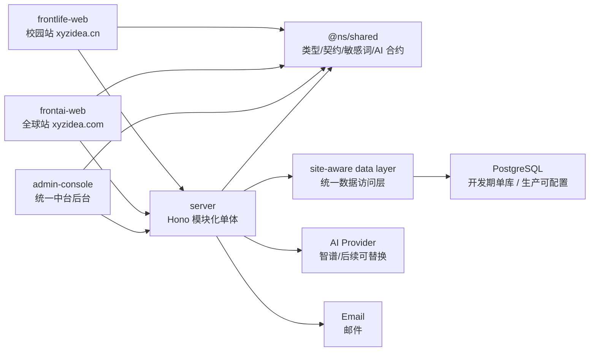
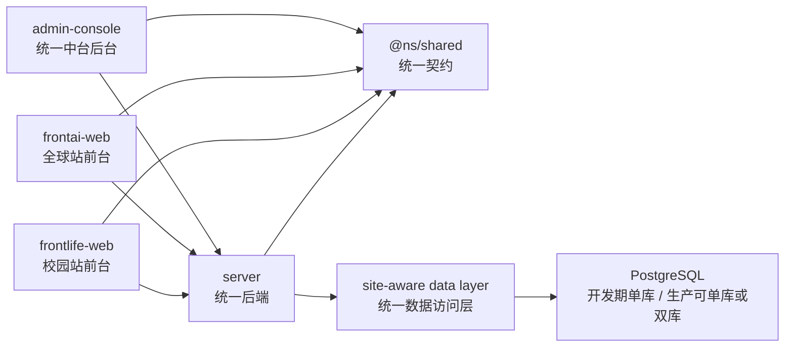

# 盘根全量 PRD 二站一后端架构设计方案

> 日期：2026-04-24
> 会议目标：重新召开产品研发会，目标从“内测优先”调整为“完成所有 PRD 研发任务”
> 主导：Pieter Levels
> 与会：Adam Wathan、Kent C. Dodds team
> 产品审理：Cat Wu（Claude Code 产品经理视角）
> 旁观提问：Tim Cook、Elon Musk
> 输入文档：`specs/MISSION.md`、`specs/PRD-盘根校园-v9.md`、`specs/PRD-盘根AI指南针-标准版.md`、`specs/meetings/meeting-08-dev-plan.md`
> 说明：本文为风格化内部架构会纪要和设计方案，不代表任何真实人物的实际发言。

---

## 一、会议裁定

本次会议不再以 `v0.4-campus-beta` 的封闭内测为唯一目标，而是以两份 PRD 的全量研发完成为目标。

最终裁定：

> 采用“二站独立产品面 + 单后端模块化单体 + 单中台后台 + 统一逻辑数据模型 + shared 契约包”的架构。

也就是：

- 校园站 `frontlife-web` 独立演进，服务 `xyzidea.cn`。
- 全球站 `frontai-web` 独立演进，服务 `xyzidea.com`。
- 后端 `server` 保持一个代码库，但按 `site`、业务域和部署环境分层。
- 中台后台统一为一个管理产品，通过站点上下文、角色和权限切换校园站/全球站任务。
- 数据层保持一套 schema、一套迁移、一套 repository 契约；部署时允许按合规要求选择单库逻辑隔离或双库物理隔离。
- 共享包 `@ns/shared` 只放类型、契约、纯函数、敏感词和种子常量，不引入任何 UI。
- 原型/开发期默认单库逻辑隔离；正式上线是否物理隔离由合规、部署地区和数据驻留要求决定，但代码必须支持无分叉切换。

不采用：

- 不把两站用户前台合成一个前端壳。
- 不在现在拆微服务。
- 不为了复用强行统一两站 UI。
- 不新增兼容层保存旧原型行为。

---

## 二、当前实际基线

### 2.1 已有代码结构

```text
NorthStar/packages/
  frontlife-web   # 校园站 React + Tailwind + Zustand
  frontai-web     # 全球站 React + Tailwind + Zustand/React Query
  server          # Hono + Drizzle + PostgreSQL
  shared          # @ns/shared，纯 TypeScript
```

### 2.2 当前后端路由

已有：

- `ai`
- `articles`
- `auth`
- `favorites`
- `feed`
- `feedbacks`
- `me`
- `notifications`
- `posts`
- `reports`
- `search`
- `spaces`

这些已经足够支撑校园站主路径，但还不足以支撑两份 PRD 全量。

### 2.3 当前主要缺口

校园站缺口：

- 用户名 + 邮箱注册登录
- 用户协议、隐私政策、注销账号、数据删除
- 完整审核台
- 空间创建/认领完整流程
- 搜索全文索引和需求分析闭环
- 过期提醒、认证邀请、空间认领邀请等通知自动触发
- 指标采集与运营分析

全球站缺口：

- 申请制、邀请制、GitHub OAuth
- 工具、文章、专题、资讯真实 CRUD
- 方案保存、导出、收藏、额度
- 用户后台真实数据
- 申请审核、内容审核、用户管理、数据看板
- 支付/额度管理
- 邮件通知
- GDPR 数据权利

后端缺口：

- `site` 隔离不完整
- `config` 配置表缺失
- 审核、合规、支付、额度、邮件、指标模块缺失
- PostgreSQL 全文搜索未落地
- 单库逻辑隔离与双库物理隔离的可配置部署方案未落地

---

## 三、Pieter Levels 架构方案

### 3.1 核心判断

全量 PRD 不等于一次性大重构。全量开发要按“可上线的垂直切片”推进。

Pieter 反对现在拆微服务，原因是：

- 团队还在产品验证期，微服务会放大沟通和部署成本。
- 当前后端 Hono + Drizzle 已经能支撑模块化单体。
- PRD 全量的主要难点是产品闭环，不是服务拆分。

### 3.2 Pieter 推荐架构

```text
两个独立前端
  frontlife-web
  frontai-web

一个模块化后端
  server
    identity
    campus
    compass
    content
    moderation
    ai-gateway
    notification
    analytics
    billing
    compliance

一个共享契约包
  shared
```

### 3.3 Pieter 的实现原则

- 每个模块都必须能独立验收。
- 不做空后台页面，后台页面必须接真实数据。
- 每个 PRD 模块以一个用户行为为单位交付。
- 先把 cn 站跑完整，再把通用能力抽给 com 站。
- 全球站不再停留在 mock，必须接真实后端。

### 3.4 Pieter 的全量交付顺序

1. 信任和账号：登录、注销、合规、审核
2. 校园完整闭环：空间、内容、创作、通知、搜索、指标
3. 全球完整闭环：申请、工具、方案、收藏、后台
4. 运营闭环：看板、邮件、额度、支付
5. 上线闭环：数据隔离部署、备案、数据删除、审计

---

## 四、Adam Wathan 架构方案

### 4.1 核心判断

两站的产品气质不同，UI 不应强行统一。

校园站是高频生活工具，应该移动优先、轻、快、可信。

全球站是 AI 工作流产品，应该更像工作台，适合内容浏览、方案生成、保存、导出和后台操作。

### 4.2 Adam 推荐前端架构

```text
frontlife-web
  pages/
    HomePage
    SearchResultPage
    ExplorePage
    SpacePage
    ArticlePage
    ProfilePage
    LoginPage
    LegalPages
    ModerationPages
  store/
    useSearchStore
    useSpaceStore
    useUserStore
    useUIStore
  services/
    api
    authSession
    mockApi

frontai-web
  pages/
    HomePage
    ToolDetailPage
    ArticleReadPage
    SolutionNewPage
    UserCenterPage
    LoginPage
    Admin/*
  services/
    api
    AIService
  store/
    useAppStore
    useContentStore
    useReviewStore
```

### 4.3 Adam 的 UI 边界

共享：

- API 类型
- AI 契约
- 敏感词工具
- 通用领域类型
- Lucide 图标规范

不共享：

- 页面组件
- 布局组件
- Tailwind 主题
- 交互细节

原因：

> 两站的使用场景不同。共享 UI 会让两个产品都变钝。

### 4.4 Adam 的后台设计

后台是一个统一产品，内部按任务分区：

- 校园站运营任务：审核、举报、变化反馈、空间认领、认证邀请、搜索需求。
- 全球站管理任务：内容、工具、申请、审核、用户、额度、支付、系统设置、审计。

不做两个后台。做一个 `admin-console`，入口统一，内部通过站点上下文、角色权限和任务模块分区。

---

## 五、Kent C. Dodds 架构方案

### 5.1 核心判断

全量 PRD 最大风险不是写不出来，而是写完后不可验证、不可维护、不可安全修改。

### 5.2 Kent 推荐后端分层

```text
server/src/
  index.ts
  middleware/
    auth.ts
    site.ts
    error.ts
    rateLimit.ts
  db/
    schema.ts
    client.ts
  modules/
    identity/
      routes.ts
      service.ts
      repository.ts
      types.ts
    campus/
      spaces/
      articles/
      posts/
      feedbacks/
    compass/
      tools/
      topics/
      solutions/
      quotas/
    moderation/
    notification/
    analytics/
    ai/
    compliance/
    billing/
  scripts/
    seed.ts
    smoke.ts
    metrics.ts
```

### 5.3 Kent 的测试要求

每个 PRD 全量模块至少有一种验证：

- API 行为测试
- 前端关键路径测试
- seed 可复现测试
- smoke 脚本
- 数据删除/隔离专项测试

强制覆盖：

- cn 用户数据不流向 com
- com 用户数据不流向 cn
- 未登录不能写
- 权限不足不能写长文章/创建空间/进入后台
- AI key 缺失必须 fallback
- 注销后登录态失效
- 举报/审核状态可追踪
- 支付/额度不能被前端篡改

### 5.4 Kent 的契约原则

`@ns/shared` 是契约源头：

- API request/response 类型
- AI request/response 类型
- 领域枚举
- 敏感词函数
- 站点常量

后端实现不能绕过 shared 类型，前端不能私造接口结构。

---

## 六、三方讨论

### 6.1 单后端还是双后端

Pieter：先单后端。产品还没到需要拆服务的复杂度。

Adam：同意。前端可以分开，后端不用拆成两个项目。

Kent：单后端可以，但必须有 `site` 中间件、模块边界和测试，不能让 cn/com 混查。

结论：

> 一个后端代码库，两个站点上下文，数据源由 site-aware data layer 决定；开发期默认单库，生产期可单库或双库。

### 6.2 单库还是双库

Pieter：开发阶段单库方便。

Kent：正式上线必须保留物理隔离能力，尤其 cn/com 合规边界不同；但不应把物理隔离写成唯一部署形态。

Adam：前端不应该感知数据库怎么隔离。

结论：

> 开发期采用单 PostgreSQL + `site` 字段。生产期通过配置选择单库逻辑隔离或 cn/com 双库物理隔离。代码不分叉，前端不感知。

### 6.3 统一后台还是两个后台

Pieter：不要超级后台。

Adam：后台是任务工具，不是展示产品。

Kent：权限模型可以统一，页面入口要分清楚。

结论：

> 后端统一管理模块，前端统一为一个 `admin-console`，内部按站点和任务切换。

### 6.4 AI 网关怎么设计

Pieter：统一 AI 网关，避免两个前端各写 prompt。

Kent：AI 输入输出都要敏感词过滤、日志、限流、fallback。

Adam：用户看到的是“答案/方案”，不是模型。

结论：

> AI 网关统一在后端，前端只传业务意图和上下文。所有 AI 输出必须标注来源和 fallback 状态。

### 6.5 全量 PRD 是否需要一次性大迁移

三方一致否决。

结论：

> 架构按终态设计，开发按垂直切片推进。

---

## 七、Cat Wu 产品经理审理

Cat Wu 提出 10 个问题：

1. 全量 PRD 的完成定义是什么？
2. 校园站和全球站谁先达到上线标准？
3. 哪些模块是两站共用，哪些必须隔离？
4. 用户删除账号后，内容、反馈、日志怎么处理？
5. 全球站申请制、邮箱验证和 GitHub OAuth 是上线阻塞项还是增强项？
6. 支付和额度如果不上，全球站是否算全量完成？
7. 校园站的“学校/机构”角色是否进入本轮架构？
8. AI 生成内容的标注、过滤、审计是否覆盖两站？
9. 运营后台是否能处理用户真实反馈，而不是只展示列表？
10. 每个模块如何验收，不靠口头说完成？

产品经理裁定：

> 全量 PRD 研发计划必须以“功能模块 + 数据模型 + API + 页面 + 权限 + 测试 + 验收脚本”七件套为完成标准。

---

## 八、Tim Cook 旁观问题

Cook 视角提出：

1. 用户是否能理解自己把什么数据交给了盘根？
2. 用户是否能撤回、删除、导出自己的数据？
3. cn/com 数据是否在架构上明确隔离？
4. AI 是否永远不冒充人工确认内容？
5. 后台人员操作是否有审计记录？
6. 移动端体验是否是完整产品，而不是桌面端的缩小版？
7. 合规页面是否和产品一样认真，而不是临时文案？

Cook 的架构要求：

> 合规不是上线前补丁，必须成为后端模块和前端入口。

---

## 九、Elon Musk 旁观问题

Musk 视角提出：

1. 如果必须 30 天完成全量 PRD，哪些模块可以并行？
2. 哪些功能是假复杂，应该删掉或延后？
3. 单后端是否会成为瓶颈？
4. 全球站如果没有支付，是否还值得完整开发？
5. 真实用户最先会打爆哪个接口？
6. 哪个指标能说明两站连接真的成立？
7. 每周能不能交付一个可演示的完整闭环？

Musk 的压力测试：

> 不要把架构图当进度。每周必须有一个真实闭环从前端到数据库跑通。

---

## 十、二次思考

### 10.1 使命层约束

使命文件给出两条线：

- 校园站：搜一下，可信的。
- 全球站：说一声，方案给你。

所以架构必须支持：

- 校园站的可信来源、确认、变化、审核、空间沉淀。
- 全球站的方案生成、保存、导出、复用、额度和后台运营。
- 两站自然连接，但账号和数据不互通。

### 10.2 PRD 层约束

校园 PRD v9 要求完整校园产品：

- 6 页面结构
- 搜索/空间/阅读/写/关系/通知/个人页
- 用户名邮箱注册、注销、合规、审核
- AI 网关、搜索日志、数据分析

全球 PRD 要求完整 AI 指南针：

- 首页、搜索、工具、文章、方案、收藏、用户后台
- 申请制、邀请制、GitHub OAuth
- 内容管理、用户管理、申请审核、数据看板、支付、系统设置、内容审核
- AI 网关、智能分析、行为采集、邮件通知、GDPR

### 10.3 架构层结论

PRD 全量开发的正确形态不是“校园站代码继续长大，全球站继续 mock”，而是：

> 以后端领域模块为骨架，以两个独立前端为产品面，以 shared 契约为边界，逐步把 mock 和占位页面替换成真实数据闭环。

---

## 十一、最终架构设计

### 11.1 总体架构



### 11.2 后端模块

| 模块 | 负责范围 | 服务对象 |
|---|---|---|
| `site` | 站点解析、数据源选择、cn/com 隔离 | 两站 |
| `identity` | 用户名邮箱注册、登录、JWT、邮箱验证、GitHub OAuth、邀请、注销 | 两站 |
| `campus` | 空间、文章、帖子、反馈、收藏、通知 | 校园站 |
| `compass` | 工具、专题、文章、方案、收藏、额度 | 全球站 |
| `content` | 内容 CRUD、上下架、版本、草稿 | 两站 |
| `moderation` | 举报、审核队列、敏感词、AI 输出审查 | 两站 |
| `ai-gateway` | AI 搜索、AI 写作、方案生成、fallback、限流 | 两站 |
| `notification` | 站内通知、邮件通知 | 两站 |
| `analytics` | 搜索日志、行为事件、指标脚本、漏斗 | 两站 |
| `billing` | 额度、套餐、支付、调用扣费 | 全球站 |
| `compliance` | 协议、隐私、数据导出、数据删除、审计日志 | 两站 |
| `admin` | 管理 API 聚合，不直接持有业务规则 | 两站 |

### 11.3 API 命名空间

```text
/api/health

/api/auth/*
/api/me/*
/api/legal/*
/api/compliance/*

/api/campus/spaces/*
/api/campus/articles/*
/api/campus/posts/*
/api/campus/search/*
/api/campus/feed/*
/api/campus/notifications/*

/api/compass/tools/*
/api/compass/topics/*
/api/compass/articles/*
/api/compass/solutions/*
/api/compass/favorites/*
/api/compass/quota/*

/api/ai/search
/api/ai/write
/api/ai/tools
/api/ai/analyze

/api/moderation/*
/api/admin/*
/api/analytics/*
/api/billing/*
```

迁移策略：

- 新开发统一使用命名空间 API。
- 已有校园站路由作为待替换对象，不新增兼容层。
- 页面接入新接口后，直接删除旧调用路径。
- mock 只保留开发演示用途，不作为生产兼容目标。

### 11.4 数据库终态

开发期：

```text
一个 PostgreSQL
  所有核心业务表带 site 字段
  seed 支持 cn/com 双站数据
```

生产期：

```text
方案 A：单 PostgreSQL 逻辑隔离
  一套 schema
  所有跨站表通过 site 字段隔离
  后台跨站访问必须显式授权并写审计

方案 B：cn/com 双 PostgreSQL 物理隔离
  cn 库保存校园站用户、内容、行为、审核、邮件验证日志
  com 库保存全球站用户、工具、方案、支付、申请、邮件日志
  两库使用同一套 migration 和 repository 契约
```

共享表策略：

- 配置、敏感词、AI provider 配置可以由脚本同步。
- 用户表不共享。
- 行为数据不跨站。
- 校园站到全球站只传来源统计，不传登录态和个人数据。

### 11.5 关键表增量

需要新增或调整：

| 表 | 用途 |
|---|---|
| `site_configs` | 站点配置、阈值、开关 |
| `legal_documents` | 用户协议、隐私政策版本 |
| `user_consents` | 用户同意记录 |
| `account_deletion_requests` | 注销和删除进度 |
| `audit_logs` | 后台操作审计 |
| `moderation_tasks` | 举报/审核/AI 输出审核队列 |
| `content_versions` | 文章/工具/方案版本 |
| `tool_records` | 全球站工具 |
| `topics` | 全球站专题 |
| `solutions` | 用户生成方案 |
| `solution_exports` | 导出记录 |
| `quotas` | 用户额度 |
| `billing_orders` | 支付订单 |
| `application_requests` | 全球站申请制注册 |
| `invite_codes` | 邀请码 |
| `behavior_events` | 行为采集白名单事件 |
| `notification_deliveries` | 站内/邮件投递记录 |
| `search_documents` | 全文搜索索引或物化数据 |

### 11.6 认证架构

校园站：

- 用户名 + 邮箱注册登录
- 邮箱验证作为账号可信度信号
- JWT session
- 可绑定学校/城市
- 注销账号和数据删除必须上线前完成

全球站：

- 用户名 + 邮箱注册登录
- 申请制
- 邀请制
- GitHub OAuth
- 邮箱通知审核结果
- 用户额度与方案保存绑定账号

两站共同：

- 登录态不互通
- Cookie/token 域隔离
- 权限通过后端计算，不让前端决定
- 账号删除走 `compliance` 模块

### 11.7 AI 网关架构

AI 统一后端代理：

```text
前端业务请求
  -> ai-gateway
  -> 敏感词输入检查
  -> 配额/限流
  -> prompt 组装
  -> AI provider
  -> 输出敏感词检查
  -> fallback 或正常响应
  -> 写入 ai_call_logs / behavior_events
```

AI 能力：

- 校园搜索兜底
- 校园写作引导
- 内容摘要
- 过期风险检测
- 全球工具推荐
- 全球方案生成
- 内容质量分析

AI 禁止：

- 自动发布内容
- 替用户做选择
- 冒充人工确认
- 绕过审核输出敏感内容

### 11.8 审核架构

统一 `moderation` 模块，站点策略不同：

校园站：

- 举报文章/帖子
- “有变化”反馈处理
- 空间认领审核
- 认证作者邀请/审批
- 先发后审 + 人工处理

全球站：

- 注册申请审核
- 内容发布审核
- 工具上架审核
- AI 输出抽检
- 用户状态处理

状态机：

```text
pending -> in_review -> resolved
pending -> in_review -> dismissed
pending -> escalated -> resolved
```

每次状态变化写 `audit_logs`。

### 11.9 指标架构

先做事件表和脚本，不先做复杂看板。

核心事件：

- search_submitted
- search_result_clicked
- ai_fallback_used
- article_read
- feedback_helpful
- feedback_changed
- post_created
- reply_created
- solution_generated
- solution_saved
- solution_exported
- global_signup_from_campus

核心指标：

- 校园站本地命中率
- AI 兜底占比
- 有帮助/有变化次数
- 求助解决率
- 第二次使用率
- 全球站方案生成完成率
- 方案保存率
- 方案有效率
- 校园到全球转化数

---

## 十二、全量 PRD 开发里程碑

### M1：架构基线重整

目标：后端模块边界和 API 命名空间明确。

交付：

- `site` 中间件
- `identity` 模块骨架
- `compliance` 模块骨架
- `moderation` 模块骨架
- `compass` 模块骨架
- shared API 契约更新

验收：

- 两站前端仍能启动。
- 已切换模块只调用新命名空间 API。
- 被替换的旧调用路径已删除。
- 新模块有最小测试。

### M2：校园站 PRD 全量闭环

目标：校园站达到 PRD v9 上线形态。

交付：

- 用户名邮箱注册登录
- 用户协议/隐私政策
- 注销账号/数据删除
- 审核台
- 空间创建/认领
- 通知 6 类型真实触发
- 搜索日志分析
- PostgreSQL 全文搜索
- 数据指标脚本

验收：

- 校园 PRD 逐项对照通过。
- cn 数据隔离测试通过。
- 真实 API smoke 通过。

### M3：全球站 PRD 全量闭环

目标：全球站从原型变成真实产品。

交付：

- 用户名邮箱注册、申请制/邀请制/GitHub OAuth
- 工具/专题/文章 CRUD
- 方案生成、保存、导出
- 收藏和用户后台
- 额度系统
- 内容工作室真实后端
- 申请审核和内容审核
- 邮件通知

验收：

- 全球站 PRD 逐项对照通过。
- com 数据隔离测试通过。
- AI tools fallback 和真实模式都通过。

### M4：管理与运营闭环

目标：团队能运营两个站。

交付：

- 统一中台后台 `admin-console`
- 审计日志
- 数据查询脚本
- 基础看板
- 支付订单管理
- 系统配置

验收：

- 后台不再有 placeholder。
- 每个后台按钮接真实 API。
- 权限和审计覆盖。

### M5：上线与合规闭环

目标：两站具备上线条件。

交付：

- 数据隔离部署方案：单库逻辑隔离或 cn/com 双库物理隔离
- cn 用户名邮箱注册与邮箱验证
- com GDPR 数据权利
- 隐私/协议版本管理
- 数据删除任务
- 生产环境变量检查
- 发布 checklist

验收：

- 两站各自上线 smoke 通过。
- 数据隔离专项通过。
- 安全审查通过。

---

## 十三、并行开发分工

### Lane A：后端架构与数据

负责：

- 模块目录
- schema 增量
- API 命名空间
- site 数据隔离
- 测试和 seed

### Lane B：校园站全量

负责：

- 用户名邮箱注册登录
- 合规页
- 账号注销
- 审核台
- 空间认领
- 通知触发
- 搜索升级

### Lane C：全球站全量

负责：

- 真实登录
- 工具/内容/专题
- 方案保存导出
- 用户后台
- 管理后台去 placeholder
- 额度/支付

### Lane D：AI、审核、指标

负责：

- AI 网关
- fallback
- 敏感词
- 审核任务
- 行为事件
- 指标脚本

---

## 十四、验收标准

一个 PRD 模块完成，必须同时满足：

1. 数据模型存在。
2. API 存在。
3. 前端页面或入口存在。
4. 权限和错误态处理存在。
5. 空态存在。
6. 测试或 smoke 脚本存在。
7. 文档 checklist 更新。

不满足七件套，不算完成。

---

## 十五、会议续审：统一数据库、统一后端、统一中台后台议案

### 15.1 用户议案

用户提出的理想状态：

> 两个站的关系本质一致，都是为了同一个使命服务。理想形态应该是同一个数据库、同一个后端、同一个中台后台，而不是把两套系统越拆越远。

会议接受这个议案重新审理。

### 15.2 Pieter Levels 审理

Pieter 支持统一后端和统一中台后台。

他的判断：

- 一个团队做两个站，不能维护两套后台。
- 后端拆成两个项目会让功能重复，尤其是登录、审核、AI、通知、指标。
- 数据模型也应该统一，否则校园站沉淀出的内容和全球站工具方案无法形成长期连接。

但 Pieter 反对把“统一”理解为“所有数据无边界混在一起”。

他的批判：

> 同一个数据库实例能降低早期成本，但如果没有 `site`、权限和数据边界，后面会变成不可拆的混乱系统。

Pieter 投票：

- 同一后端：赞成
- 同一中台后台：赞成
- 同一套 schema：赞成
- 同一物理数据库实例永久承载两站全部数据：反对

### 15.3 Adam Wathan 审理

Adam 支持统一中台后台，但坚持两站前台不要合并。

他的判断：

- 校园站前台是生活工具，要轻、移动优先、低干扰。
- 全球站前台是 AI 工作流工具，要支持浏览、生成、保存、导出和管理。
- 后台的任务可以统一，但用户前台的产品质感不该统一。

他给出的折中方案：

```text
前台：两个产品
  frontlife-web
  frontai-web

后台：一个产品
  admin console
    site = cn | com | all
    modules = content / moderation / users / analytics / billing / config
```

Adam 投票：

- 同一后端：赞成
- 同一后台壳：赞成
- 同一前台：反对
- 同一 UI 组件体系：反对

### 15.4 Kent C. Dodds 审理

Kent 支持统一逻辑数据层，但要求用测试证明隔离边界。

他的判断：

- “同库”可以有两种含义：
  1. 同一个物理 PostgreSQL 实例。
  2. 同一套 schema、migration、repository、查询契约。
- 第二种是架构上正确的统一。
- 第一种只能作为开发期或特定部署条件下的选择，不能变成代码假设。

Kent 的底线：

- 所有业务表必须有站点边界，或天然只属于一个站点模块。
- 所有查询必须经过 site context。
- 后台跨站查询必须需要显式权限。
- 数据删除、导出、审计必须按站点隔离。
- 测试必须覆盖“cn 用户看不到 com 数据，com 用户看不到 cn 数据”。

Kent 投票：

- 单代码库后端：赞成
- 单逻辑数据库模型：赞成
- 单物理数据库作为开发默认：赞成
- 单物理数据库作为不可变生产架构：反对

### 15.5 Cat Wu 产品经理审理

Cat Wu 认可用户的产品直觉：

> 两站不是两个公司，也不是两个产品宇宙。它们都是盘根服务用户的两种路径。

但她要求把“统一”拆成四层：

| 层级 | 是否统一 | 理由 |
|---|---|---|
| 使命 | 统一 | 都是让 AI 服务于人 |
| 后端能力 | 统一 | 登录、审核、AI、通知、指标、合规应复用 |
| 中台后台 | 统一 | 团队运营不应维护两套后台 |
| 用户前台 | 不统一 | 校园站和全球站用户场景不同 |
| 物理数据存储 | 可配置 | 由合规和部署决定 |

Cat Wu 裁定：

> 用户的方向是对的：系统能力应统一。需要修正的是，不要把“统一能力”误写成“无边界混库”。

### 15.6 Tim Cook 旁观提问

Cook 提出问题：

1. 用户是否知道自己的数据属于哪个站？
2. 后台人员跨站查看数据是否有审计？
3. 如果未来监管要求 cn 数据本地化，同一数据库方案能否无痛拆分？
4. 用户注销时，是否能只删除对应站点数据？
5. 同一个后台是否会让运营人员误操作另一个站点？

Cook 的结论：

> 统一后台可以，但必须有清晰边界、权限和审计。信任来自统一体验，不来自数据混放。

### 15.7 Elon Musk 旁观提问

Musk 提出问题：

1. 用一个数据库是不是为了快，还是为了逃避架构决策？
2. 如果 30 天内要完成全量 PRD，统一后端能不能让并行开发更快？
3. 如果未来必须拆库，今天的 schema 会不会卡死？
4. 后台能不能一个入口处理所有事？
5. 哪些模块必须马上统一，哪些可以以后统一？

Musk 的结论：

> 统一是对的，但必须是能拆的统一。不要做两个系统，也不要做一个拆不开的系统。

### 15.8 二次思考

会议重新定义“最理想状态”：

不是：

```text
一个前台 + 一个后端 + 一个无边界数据库
```

而是：

```text
两个用户前台
一个后端
一个中台后台
一套逻辑数据模型
一套 shared 契约
一个 site-aware 数据访问层
开发期单库
生产期可单库也可双库
```

这个结构同时满足：

- 用户想要的统一系统能力
- PRD 想要的双站使命连接
- 工程上不重复造轮子
- 合规上保留拆分能力
- 后续团队运营只进一个后台

### 15.9 修订后的架构定义

最终架构命名为：

> 盘根统一平台架构（Unified PanGen Platform）

结构：



关键规则：

- 两个前台独立。
- 一个后端。
- 一个中台后台。
- 一套 schema 和 migration。
- 所有表和查询必须有站点边界。
- 所有后台操作必须有审计。
- 不写旧接口兼容层。
- 新模块直接接统一命名空间 API。

---

## 十六、最终决议

1. 全量 PRD 开发采用“盘根统一平台架构”。
2. 用户前台保留两个：校园站 `frontlife-web`、全球站 `frontai-web`。
3. 后端统一为一个：`server` 模块化单体。
4. 中台后台统一为一个：`admin-console`，通过站点上下文和权限区分任务。
5. 数据模型统一为一套 schema、一套 migration、一套 repository 契约。
6. 开发期默认单 PostgreSQL 逻辑隔离。
7. 生产期数据存储必须可配置：可单库逻辑隔离，也可 cn/com 双库物理隔离。
8. 所有数据访问必须经过 site-aware data layer。
9. 不写旧接口兼容层，新模块直接接统一命名空间 API。
10. 校园站和全球站按全量 PRD 并行推进，但以后端统一能力为先。
11. 全量 PRD 完成以七件套验收，不以页面存在或文档勾选为准。
12. 下一步应把本架构方案拆成 `full-prd-dev-plan.md`，逐项列任务、依赖、验收命令和可并行 lane。

---

## 十七、幸福导向架构复审

### 17.1 主持原则

本轮由“为了人的幸福的哲学家架构师”主导。

这里的“幸福”不指抽象口号，而指产品和系统实际减少人的负担：

- 学生少问重复问题，少被过期信息误导。
- 作者少重复解释，持续投入能被看见。
- 团队少维护重复系统，能把精力用在用户和内容质量上。
- 学校和机构少用低效渠道反复通知，信息能被正确触达。
- 全球站用户少在工具海里迷路，能拿到可执行方案。
- 开发者少背历史包袱，能清楚、安全地继续建设。

架构不是为了漂亮，而是为了让这些人的生活和工作更轻。

### 17.2 哲学家架构师初审

哲学家架构师先提出一个反问：

> 如果架构让团队每天都在维护旧接口、重复后台、重复数据模型，那么它即使“技术上正确”，也会降低人的幸福。

因此，本架构必须遵守四个判断：

1. 统一不是为了抽象优雅，而是为了减少重复劳动。
2. 隔离不是为了制造边界，而是为了保护信任和数据权利。
3. 不写兼容代码不是懒惰，而是避免把错误路径永久化。
4. PRD 全量开发不是堆功能，而是把用户从混乱中带到可执行、可信、可持续的状态。

### 17.3 不写兼容代码的原则升级

默认规则：

> 如果没有显性要求，尽量不要写兼容代码。

执行含义：

- 新模块直接接目标接口。
- 页面切到新接口后，删除旧调用路径。
- mock 不作为生产兼容目标。
- 旧字段不保留双写。
- 旧路由不新增桥接层。
- 旧 UI 入口不继续隐藏保留。
- 只有在数据迁移、外部 API、用户已公开依赖、法规要求这四类场景下，才允许写临时兼容层。

兼容层如果确实必须存在，必须满足：

- 有明确删除日期或删除条件。
- 有 owner。
- 有测试覆盖。
- 有文档说明为什么不能直接删除。

### 17.4 Cat Wu 产品经理审理

Cat Wu 的问题：

1. 用户是否会因为我们保留旧路径而看到两个不同答案？
2. 运营人员是否会因为两个后台入口而处理错内容？
3. 开发者是否会因为双接口并存而不知道该接哪个？
4. PRD 的全量完成，是不是被“兼容旧实现”拖慢？
5. 每个新增模块是否能解释它给用户减少了什么负担？

Cat Wu 裁定：

> 全量 PRD 开发必须以目标形态为准。旧实现只能作为事实基线，不能作为设计约束。

### 17.5 Tim Cook 旁观审理

Cook 的问题：

1. 用户的数据边界是否清晰？
2. 用户删除账号后，旧兼容路径是否还会留下数据？
3. AI 生成内容和人工确认内容是否永远不会混淆？
4. 一个统一后台是否能做到误操作可追踪、可撤销、可审计？
5. 统一系统是否让体验更一致，而不是让复杂性暴露给用户？

Cook 的裁定：

> 信任不是靠声明建立的。信任来自清晰边界、稳定体验、可撤销权利和可审计操作。

### 17.6 Elon Musk 旁观审理

Musk 的问题：

1. 如果删掉所有兼容路径，系统会不会更快完成？
2. 哪些功能只是因为旧实现存在才被保留？
3. 单后端、单后台、单 schema 能否让四条开发 lane 真正并行？
4. 哪个模块最先证明“统一平台”比“两套系统”更快？
5. 如果 30 天后还没完成全量 PRD，最大阻塞会是什么？

Musk 的裁定：

> 速度来自删除。统一平台是为了减少路径，不是为了把所有路径都留下。

### 17.7 二次思考

会议重新确认：

盘根不是要建一个“技术上很完整”的系统，而是要建一个能持续降低混乱的系统。

因此，架构的第一性目标是：

```text
减少用户的信息混乱
减少团队的维护混乱
减少数据和权限的责任混乱
减少未来开发者的认知混乱
```

统一平台和不写兼容代码，是同一件事的两面：

- 统一平台减少系统数量。
- 不写兼容代码减少历史路径。

### 17.8 幸福导向架构决议

1. 架构目标从“二站一后端”升级为“盘根统一平台”。
2. 所有新模块必须说明它减少了哪类人的哪种负担。
3. 不写兼容代码成为默认工程规则。
4. 兼容层必须显性申请，并记录删除条件。
5. 后台统一，避免团队重复运营。
6. 数据边界清晰，避免用户信任被破坏。
7. AI 永远是服务能力，不是替人做决定的角色。
8. 任何 PRD 任务如果不能减少混乱，需要重新审理。
9. 下一份 `full-prd-dev-plan.md` 必须按“减少混乱”的价值来排序，而不是按功能大小排序。
