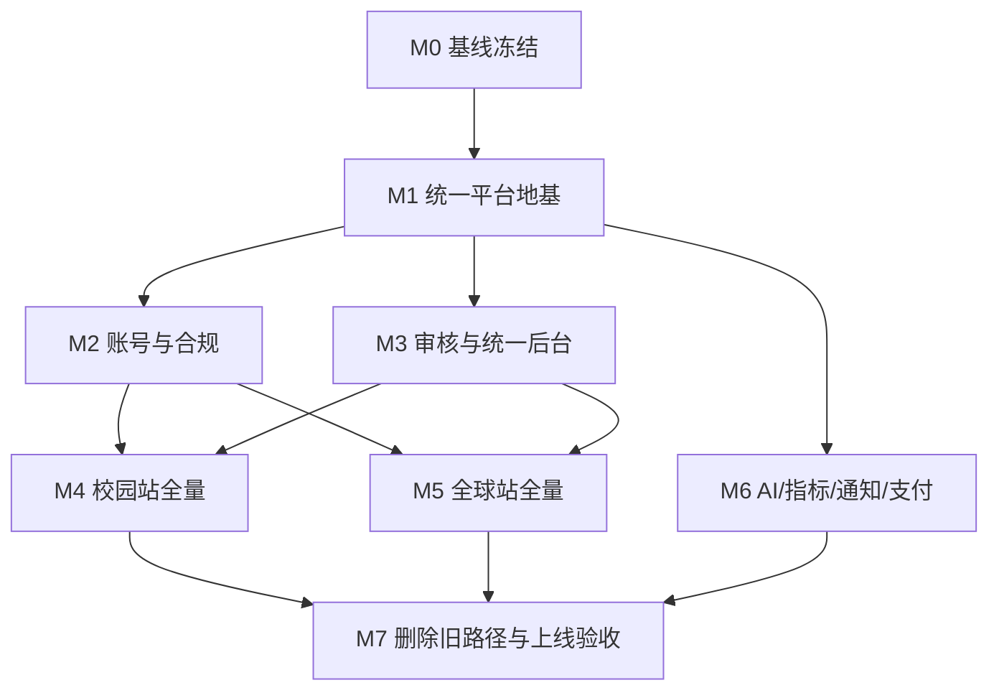

# 盘根统一平台全量 PRD 实现方案

> 日期：2026-04-24
> 状态：P0 平台闭环进行中；M0/M1 已落地，M2/M3 最小闭环部分完成
> 输入：
> - `specs/MISSION.md`
> - `specs/PRD-盘根校园-v9.md`
> - `specs/PRD-盘根AI指南针-标准版.md`
> - `specs/architecture/architect-workshop-final-design.md`
> - `specs/architecture/full-prd-two-sites-one-backend-architecture.md`
> 原则：
> - 完成两份 PRD 的全量研发任务
> - 采用盘根统一平台架构
> - 默认不写兼容代码
> - 用户名前台分开，平台能力统一
> - 每个模块必须减少某类人的混乱

---

## 一、目标

把盘根从当前 `v0.3.1` 的“校园站核心产品完成 + 全球站原型成型”，推进到“两份 PRD 全量完成”。

最终交付形态：

```text
frontlife-web      校园站用户前台
frontai-web        全球站用户前台
admin-console      统一中台后台
server             统一模块化后端
@ns/shared         统一契约包
site-aware DAL     统一数据访问层
PostgreSQL         开发期单库，生产可单库或双库
AI Provider        后端统一代理
Email Provider     邮箱验证与通知
Payment Provider   全球站额度与支付
```

---

## 二、当前基线

### 2.1 已完成

校园站主线已完成：

- 首页
- 搜索结果页
- 探索页
- 空间页
- 文章阅读页
- 我的页
- 登录页
- 搜索、阅读、反馈、举报、发帖、回复、解决、收藏、通知、AI 写作
- 真实 API 模式
- AI fallback
- 错误态和空态基础收口

后端已有：

- `spaces`
- `articles`
- `posts`
- `feedbacks`
- `auth`
- `reports`
- `feed`
- `search`
- `me`
- `notifications`
- `favorites`
- `ai`

全球站已有：

- 首页
- 工具页
- 文章页
- 方案生成页
- 用户中心
- 登录页
- 管理后台骨架
- `/api/ai/tools` fallback 链路

### 2.2 未完成

统一平台层：

- `admin-console` 已有真实登录、审核、用户、内容、审计、配置最小闭环
- `site-aware data layer` 已有基础实现
- 模块化后端目录已建立
- 统一 `identity` 已有用户名/邮箱注册登录、邮箱验证、密码重置、token 失效最小闭环
- 统一 `compliance` 已有协议、consent、数据导出、注销申请最小闭环
- 统一 `moderation` 已有任务、状态机、审计，校园举报/有变化已接入
- 统一 `analytics`
- 统一 `billing`
- 统一 `notification`
- shared API 契约已完成平台、identity、compliance、moderation、admin 基础扩展

校园站全量缺口：

- 用户名 + 邮箱注册登录
- 邮箱验证
- 用户协议/隐私政策
- 用户注销和数据删除
- 空间创建/认领完整流程
- 审核台
- 通知 6 类型真实触发
- PostgreSQL 全文搜索
- 搜索日志分析和需求闭环

全球站全量缺口：

- 用户名 + 邮箱注册登录
- 申请制、邀请制、GitHub OAuth
- 工具/专题/文章真实 CRUD
- 方案保存、导出、收藏
- 用户后台真实数据
- 额度系统
- 支付订单
- 内容工作室真实后端
- 申请审核和内容审核
- 邮件通知
- GDPR 数据权利

---

## 三、完成标准

一个 PRD 模块只有同时满足七件套，才算完成：

1. 数据模型存在。
2. API 存在。
3. 前端页面或入口存在。
4. 权限、错误态、空态存在。
5. 测试或 smoke 脚本存在。
6. seed 或可复现测试数据存在。
7. 文档 checklist 更新。

默认不写兼容代码：

- 新模块直接接目标命名空间 API。
- 页面接新接口后删除旧调用路径。
- mock 只保留开发演示用途，不作为生产兼容目标。
- 旧字段不双写。
- 旧 UI 入口不隐藏保留。

允许兼容层的例外：

- 数据迁移
- 外部公开 API
- 用户已经依赖的公开路径
- 法规要求的历史留存

### 3.1 当前产品约束修订

两份 PRD 中仍有少量旧表述，例如校园站手机号、短信、实名登录。当前执行以本计划为准：

- 当前注册方式统一为用户名 + 邮箱。
- 邮箱验证是账号可信度信号。
- 不接手机号，不接短信验证码。
- 不按手机号实名作为当前研发任务。
- PRD 中涉及手机号、短信、实名的任务，全部替换为用户名邮箱注册、邮箱验证、注销和数据权利闭环。

这不是兼容策略，而是产品约束修订。后续实现不保留手机号注册分支。

---

## 四、总体里程碑

| 阶段 | 名称 | 目标 | 阻塞关系 |
|---|---|---|---|
| M0 | 基线冻结 | 固定当前 v0.3.1 状态和验证口径 | 所有阶段前置 |
| M1 | 统一平台地基 | 建 `admin-console`、`site-aware DAL`、模块目录、shared 契约 | M2-M5 前置 |
| M2 | 账号与合规 | 统一 identity、邮箱注册、协议、注销、审计 | M3-M5 前置 |
| M3 | 审核与后台 | moderation、统一后台真实任务流 | M4-M6 前置 |
| M4 | 校园站全量 | 补校园 PRD 剩余功能 | 可与 M5 部分并行 |
| M5 | 全球站全量 | 把全球站从原型转真实产品 | 依赖 M1-M3 |
| M6 | AI、指标、通知、支付 | 补统一横向能力 | 与 M4/M5 并行 |
| M7 | 删除旧路径与上线验收 | 去兼容、跑全量验证、发布 | 最后阶段 |

---

## 五、M0：基线冻结

目标：确认当前已完成内容，避免全量开发时误伤。

### P0 任务

- [x] M0-1 记录当前 git commit、tag、测试结果。
- [x] M0-2 更新 `specs/release-checklist-v0.3.1.md`，标明当前为全量 PRD 起点。
- [x] M0-3 跑一次基线验证：
  - `frontlife-web` test/lint/typecheck/build
  - `frontai-web` typecheck/build
  - `server` test/typecheck
  - `db:push`
  - `db:seed`
  - 真实 API smoke
- [x] M0-4 列出现有旧路由和 mock 调用路径，标记“待替换”，不写兼容。

### 验收

- 当前功能仍通过。
- 待删除路径有清单。
- 后续每次替换都能判断是否回归。

---

## 六、M1：统一平台地基

目标：让统一平台从文档变成代码骨架。

### M1-A：工作区与包结构

- [x] M1-A1 新增 `packages/admin-console`。
- [x] M1-A2 配置 Vite、React、TypeScript、Tailwind、Lucide。
- [x] M1-A3 管理后台只接真实 API，不建长期 mock 数据层。
- [x] M1-A4 admin 顶栏固定显示当前 `site`：`cn / com / all`。
- [x] M1-A5 admin 路由：
  - `/`
  - `/content`
  - `/review`
  - `/users`
  - `/analytics`
  - `/billing`
  - `/config`
  - `/audit`

### M1-B：后端模块目录

- [x] M1-B1 重整 `server/src/modules`：
  - `platform`
  - `identity`
  - `campus`
  - `compass`
  - `moderation`
  - `ai-gateway`
  - `notification`
  - `analytics`
  - `billing`
  - `compliance`
- [x] M1-B2 新增 `server/src/middleware/site.ts`。
- [x] M1-B3 新增 `server/src/middleware/auth.ts`。
- [x] M1-B4 新增统一错误响应格式。
- [x] M1-B5 新增 API 命名空间路由：
  - `/api/campus/*`
  - `/api/compass/*`
  - `/api/admin/*`
  - `/api/moderation/*`
  - `/api/compliance/*`
  - `/api/analytics/*`
  - `/api/billing/*`
- [x] M1-B6 新增 `site_configs` 表和 platform config repository。
- [x] M1-B7 新增 `audit_logs` 基础表，供后续后台、审核、合规复用。

### M1-C：site-aware data layer

- [x] M1-C1 新增 `SiteContext`：`cn | com | all`。
- [x] M1-C2 所有新 repository 必须接收 `SiteContext`。
- [x] M1-C3 新增数据源选择器，开发期默认单库。
- [x] M1-C4 增加跨站访问保护：非 admin 不允许 `site=all`。
- [x] M1-C5 增加隔离测试：cn 用户不能读取 com 数据，反向同理。

### M1-D：shared 契约

- [x] M1-D1 新增 shared site 类型。
- [x] M1-D2 新增统一 API envelope 类型。
- [x] M1-D3 新增 admin API 类型。
- [x] M1-D4 新增 identity/compliance/moderation/analytics/billing 契约。
- [x] M1-D5 前端禁止私造新接口结构。
- [ ] M1-D6 新增 content/compass/search/news 契约，覆盖全球站工具、专题、文章、资讯和方案。

### 验收

- `admin-console` 能启动。
- `server` 保持原有测试通过。
- 新 API namespace 有 health/ping 类测试。
- `site` 隔离测试通过。

---

## 七、M2：账号与合规

目标：统一账号能力，补齐用户权利。

### M2-A：identity

- [x] M2-A1 users 表补邮箱字段、邮箱唯一索引、邮箱验证状态。
- [x] M2-A2 用户名 + 邮箱 + 密码注册。
- [x] M2-A3 邮箱登录或用户名登录。
- [x] M2-A4 邮箱验证 token。
- [x] M2-A5 密码重置。
- [x] M2-A6 JWT session 统一。
- [x] M2-A7 登录态按站点隔离。
- [x] M2-A8 权限模型统一：
  - visitor
  - user
  - editor
  - reviewer
  - operator
  - admin
- [x] M2-A9 明确账号模型：同一 identity 模块，用户记录带 `site`，两站登录态、权限上下文和数据授权不互通。
- [x] M2-A10 禁止新增手机号字段依赖；现有 phone 字段若保留，只作为历史空字段，不参与注册登录。

### M2-B：全球站申请与邀请

- [ ] M2-B1 `application_requests` 表。
- [ ] M2-B2 `invite_codes` 表。
- [ ] M2-B3 全球站申请制注册。
- [ ] M2-B4 邀请码注册。
- [ ] M2-B5 GitHub OAuth。
- [ ] M2-B6 申请审核通过后邮件通知。

### M2-C：compliance

- [x] M2-C1 `legal_documents` 表。
- [x] M2-C2 `user_consents` 表。
- [ ] M2-C3 隐私政策页。
- [ ] M2-C4 用户协议页。
- [x] M2-C5 登录/注册时记录协议版本。
- [x] M2-C6 `account_deletion_requests` 表。
- [x] M2-C7 注销账号 API。
- [ ] M2-C8 数据删除任务。
- [x] M2-C9 数据导出 API。
- [ ] M2-C10 GDPR 删除/导出流程适配全球站。

### M2-D：前端接入

- [ ] M2-D1 校园站登录页改为用户名 + 邮箱注册。
- [ ] M2-D2 全球站登录页去模拟登录，接真实注册/登录。
- [ ] M2-D3 我的页增加注销账号入口。
- [ ] M2-D4 用户中心增加数据导出入口。
- [x] M2-D5 admin 用户管理接 identity API。

### 验收

- 注册、登录、邮箱验证、退出、注销、数据导出全链路跑通。
- 校园站和全球站登录态不互通。
- 删除账号后 token 失效。
- 后端测试覆盖 identity 和 compliance。

---

## 八、M3：审核与统一后台

目标：让团队能从一个后台处理两站真实问题。

### M3-A：moderation 数据模型

- [x] M3-A1 `moderation_tasks` 表。
- [x] M3-A2 moderation task 关联 `audit_logs`。
- [x] M3-A3 reports 并入 moderation task 流。
- [x] M3-A4 “有变化”反馈进入 moderation。
- [ ] M3-A5 AI 输出抽检任务进入 moderation。
- [ ] M3-A6 申请审核进入 moderation。

### M3-B：状态机

- [x] M3-B1 状态：`pending -> in_review -> resolved`。
- [x] M3-B2 状态：`pending -> in_review -> dismissed`。
- [x] M3-B3 状态：`pending -> escalated -> resolved`。
- [x] M3-B4 所有状态变更写审计日志。
- [x] M3-B5 后台操作必须记录 actor、site、target、action、before/after。

### M3-C：admin-console

- [x] M3-C1 ReviewQueue 页面。
- [x] M3-C2 ReviewDetail 页面。
- [x] M3-C3 Site switcher。
- [x] M3-C4 用户管理。
- [x] M3-C5 内容管理。
- [x] M3-C6 审计日志页。
- [x] M3-C7 系统配置页。
- [x] M3-C8 所有页面有空态、错误态、加载态。

### M3-D：前台入口

- [x] M3-D1 校园站举报提交进入 moderation。
- [x] M3-D2 校园站“有变化”进入 moderation。
- [ ] M3-D3 全球站内容审核进入 moderation。
- [ ] M3-D4 全球站申请审核进入 moderation。

### 验收

- 一个后台能处理 cn/com 审核任务。
- 每个操作都有审计。
- 非授权用户不能访问 admin。
- 后端测试覆盖状态机。

---

## 九、M4：校园站全量 PRD

目标：补齐校园 PRD v9 的上线形态。

### M4-A：空间创建与认领

- [ ] M4-A1 `space_claim_requests` 或复用 moderation task。
- [x] M4-A2 有权限用户创建空间。
- [ ] M4-A3 空间长期无人维护后触发认领任务。
- [ ] M4-A4 认领邀请通知。
- [ ] M4-A5 admin 处理空间认领。

### M4-B：创作与成长

- [x] M4-B1 我的页显示下一步能力，不显示等级数字。
- [ ] M4-B2 editor 用户能写文章。
- [x] M4-B3 高信任用户能创建空间。
- [ ] M4-B4 认证邀请通知真实触发。
- [x] M4-B5 AI 写作生成内容必须标注 AI 辅助。

### M4-C：通知 6 类型

- [ ] M4-C1 认证邀请。
- [ ] M4-C2 内容反馈。
- [ ] M4-C3 变动提醒。
- [ ] M4-C4 过期提醒。
- [ ] M4-C5 空间认领邀请。
- [ ] M4-C6 帖子回复。
- [ ] M4-C7 顶栏和我的页未读数同步。

### M4-D：搜索升级

- [ ] M4-D1 PostgreSQL 全文搜索。
- [ ] M4-D2 `search_documents` 索引表或物化视图。
- [ ] M4-D3 本地精确匹配。
- [ ] M4-D4 本地部分匹配。
- [ ] M4-D5 无结果 AI 兜底。
- [ ] M4-D6 无结果转求助。
- [ ] M4-D7 搜索日志驱动内容缺口。

### M4-E：内容质量和 seed

- [ ] M4-E1 新生到校 7 天内容包。
- [ ] M4-E2 食堂、报到、宿舍、选课、快递、网络、二手内容补齐。
- [ ] M4-E3 清理测试感内容。
- [ ] M4-E4 seed 可复现生成校园数据。

### 验收

- 校园 PRD v9 功能逐项通过。
- 搜索、空间、阅读、写、关系、通知、我的页完整闭环。
- 断 server、空数据、失效 token、无 AI key 不白屏。

---

## 十、M5：全球站全量 PRD

目标：全球站从原型演示期进入真实产品。

### M5-A：compass 数据模型

- [ ] M5-A1 `tool_records`。
- [ ] M5-A2 `topics`。
- [ ] M5-A3 `compass_articles` 或统一 content 表带类型。
- [ ] M5-A4 `solutions`。
- [ ] M5-A5 `solution_exports`。
- [ ] M5-A6 `compass_favorites` 或统一 favorites。
- [ ] M5-A7 `quotas`。
- [ ] M5-A8 `news_items` 或统一 content 表带 `news` 类型，覆盖全球 AI 前沿资讯。
- [ ] M5-A9 `content_versions`，覆盖工具、专题、文章、资讯、方案草稿的版本记录。

### M5-B：工具/专题/文章

- [ ] M5-B1 工具列表 API。
- [ ] M5-B2 工具详情 API。
- [ ] M5-B3 专题 API。
- [ ] M5-B4 文章 API。
- [ ] M5-B5 内容工作室真实 CRUD。
- [ ] M5-B6 工具管理去 placeholder。
- [ ] M5-B7 内容发布审核。
- [ ] M5-B8 资讯列表和详情 API。
- [ ] M5-B9 全球站普通搜索：工具、专题、文章、资讯统一检索。
- [ ] M5-B10 全球站 AI 搜索：在普通搜索不足时调用 AI 网关。

### M5-C：方案生成闭环

- [ ] M5-C1 方案生成接后端 `/api/compass/solutions`。
- [ ] M5-C2 保存方案。
- [ ] M5-C3 方案列表。
- [ ] M5-C4 方案详情。
- [ ] M5-C5 导出 md/txt/csv。
- [ ] M5-C6 方案有效反馈。
- [ ] M5-C7 方案保存率统计。

### M5-D：用户后台

- [ ] M5-D1 我的方案。
- [ ] M5-D2 收藏夹。
- [ ] M5-D3 我的额度。
- [ ] M5-D4 个人资料。
- [ ] M5-D5 设置。
- [ ] M5-D6 数据导出/删除。

### M5-E：管理后台去 placeholder

- [ ] M5-E1 用户管理。
- [ ] M5-E2 工具管理。
- [ ] M5-E3 数据中心。
- [ ] M5-E4 支付管理。
- [ ] M5-E5 系统设置。
- [ ] M5-E6 申请审核。
- [ ] M5-E7 内容审核。

### 验收

- 全球站不依赖 mock 登录。
- 方案生成、保存、导出、收藏、额度全链路跑通。
- 后台无 placeholder。
- AI tools 真实模式和 fallback 都通过。

---

## 十一、M6：横向能力

目标：补齐统一平台能力。

### M6-A：AI 网关

- [ ] M6-A1 统一 AI call log。
- [ ] M6-A2 输入敏感词检查。
- [ ] M6-A3 输出敏感词检查。
- [ ] M6-A4 限流。
- [ ] M6-A5 fallback reason 标准化。
- [ ] M6-A6 校园 AI search。
- [ ] M6-A7 校园 AI write。
- [ ] M6-A8 全球 AI tools。
- [ ] M6-A9 内容质量分析。

### M6-B：analytics

- [ ] M6-B1 `behavior_events` 表。
- [ ] M6-B2 事件白名单。
- [ ] M6-B3 校园搜索成功率脚本。
- [ ] M6-B4 AI 兜底占比脚本。
- [ ] M6-B5 有帮助/有变化统计。
- [ ] M6-B6 全球方案生成完成率。
- [ ] M6-B7 方案保存率。
- [ ] M6-B8 校园到全球转化统计。
- [ ] M6-B9 admin 数据中心展示基础指标。
- [ ] M6-B10 行为数据留存策略：默认留存不超过 90 天，聚合指标可长期保留。
- [ ] M6-B11 行为数据清理脚本。

### M6-C：notification

- [ ] M6-C1 站内通知统一 API。
- [ ] M6-C2 邮件发送接口。
- [ ] M6-C3 邮件模板。
- [ ] M6-C4 投递记录。
- [ ] M6-C5 失败重试。

### M6-D：billing

- [ ] M6-D1 用户额度。
- [ ] M6-D2 AI 调用扣减。
- [ ] M6-D3 支付订单。
- [ ] M6-D4 管理后台订单页。
- [ ] M6-D5 支付 provider 抽象。
- [ ] M6-D6 原型阶段可先标记手动确认支付。

### 验收

- AI 无 key fallback 通过。
- 指标脚本能回答 PRD 北极星指标。
- 邮件通知可测试。
- 额度不能被前端篡改。

---

## 十二、M7：旧路径删除与上线验收

目标：完成全量 PRD，清理历史路径。

### M7-A：删除旧路径

- [ ] M7-A1 删除被替换的旧校园 API 调用。
- [ ] M7-A2 删除全球站模拟登录。
- [ ] M7-A3 删除后台 placeholder 页面。
- [ ] M7-A4 删除长期 mock 依赖。
- [ ] M7-A5 删除未使用组件和 store 字段。

### M7-B：全量验证

- [ ] M7-B1 `pnpm -r test`。
- [ ] M7-B2 三个前端 typecheck。
- [ ] M7-B3 三个前端 build。
- [ ] M7-B4 server typecheck/test。
- [ ] M7-B5 `db:push`。
- [ ] M7-B6 `db:seed`。
- [ ] M7-B7 校园真实 API smoke。
- [ ] M7-B8 全球真实 API smoke。
- [ ] M7-B9 admin smoke。
- [ ] M7-B10 数据隔离专项。
- [ ] M7-B11 无 AI key fallback。
- [ ] M7-B12 失效 token。
- [ ] M7-B13 空数据态。
- [ ] M7-B14 断 server。
- [ ] M7-B15 邮箱注册/验证/密码重置专项。
- [ ] M7-B16 行为数据留存和清理专项。

### M7-C：文档与发布

- [ ] M7-C1 PRD 对照表：已完成/部分完成/未完成。
- [ ] M7-C2 README 更新统一平台启动方式。
- [ ] M7-C3 release checklist。
- [ ] M7-C4 包体大小记录。
- [ ] M7-C5 Lore commit。
- [ ] M7-C6 tag。

### 验收

- 两份 PRD 全量对照通过。
- 所有新模块满足七件套。
- 没有无 owner 兼容层。
- 工作区干净。

---

## 十三、依赖关系



---

## 十四、并行执行 lane

### Lane A：平台后端

范围：

- M1-B
- M1-C
- M1-D
- M2-A
- M2-C
- M3-A
- M3-B

### Lane B：admin-console

范围：

- M1-A
- M3-C
- M5-E
- M6-B admin 展示
- M6-D 管理页

### Lane C：校园站

范围：

- M2-D 校园部分
- M4 全部
- M7 校园 smoke

### Lane D：全球站

范围：

- M2-B
- M2-D 全球部分
- M5 全部
- M7 全球 smoke

### Lane E：AI/指标/通知/支付

范围：

- M6 全部
- M7 横向验证

---

## 十五、推荐执行顺序

第一批：

1. M0 基线冻结
2. M1-A admin-console 骨架
3. M1-B 后端模块目录
4. M1-C site-aware data layer
5. M1-D shared 契约

第二批：

1. M2-A identity
2. M2-C compliance
3. M3-A moderation 数据模型
4. M3-B 状态机和审计
5. M3-C admin review queue

第三批：

1. M4 校园站全量
2. M5 全球站工具/方案真实闭环
3. M6-A AI 网关标准化
4. M6-C 通知

第四批：

1. M6-B analytics
2. M6-D billing
3. M5-E 后台去 placeholder
4. M7 删除旧路径与上线验收

---

## 十六、最小全量发布切片

如果要先交付一个能证明统一平台的版本，选择这个切片：

- `admin-console` 可登录
- `site-aware data layer`
- 用户名邮箱注册登录
- 隐私政策/用户协议
- 注销账号
- moderation task
- 校园举报/有变化进入后台
- 全球申请审核进入后台
- AI fallback 标准化
- 审计日志

这个切片能证明：

- 一个后端能服务两站。
- 一个后台能处理两站任务。
- 一套数据模型能隔离站点。
- 不写兼容代码也能推进。

---

## 十七、风险与处理

| 风险 | 处理 |
|---|---|
| 统一后端变成大泥球 | 模块目录 + repository + service 边界 + 测试 |
| 单库数据混乱 | `site-aware DAL` + 隔离测试 |
| admin-console 过大 | 按任务模块增量交付 |
| 全球站补全范围过大 | 先工具/方案/用户后台，支付后置 |
| 兼容路径拖慢开发 | 默认删除旧路径，例外必须记录删除条件 |
| PRD 任务继续膨胀 | 七件套验收，不能减少混乱的任务重新审理 |
| PRD 旧手机号表述反复干扰 | 本计划明确以用户名邮箱注册覆盖旧手机号/SMS 任务 |
| 行为数据长期留存带来合规风险 | 事件白名单 + 90 天留存 + 清理脚本 |

---

## 十八、最终结论

全量 PRD 实现不再按“校园站”和“全球站”分裂推进，而按“统一平台能力 + 两个用户前台”推进。

最先要做的不是新页面，而是：

```text
admin-console
site-aware data layer
identity
compliance
moderation
shared 契约
```

这些完成后，校园站和全球站的剩余 PRD 才能并行、稳定、少重复地完成。
