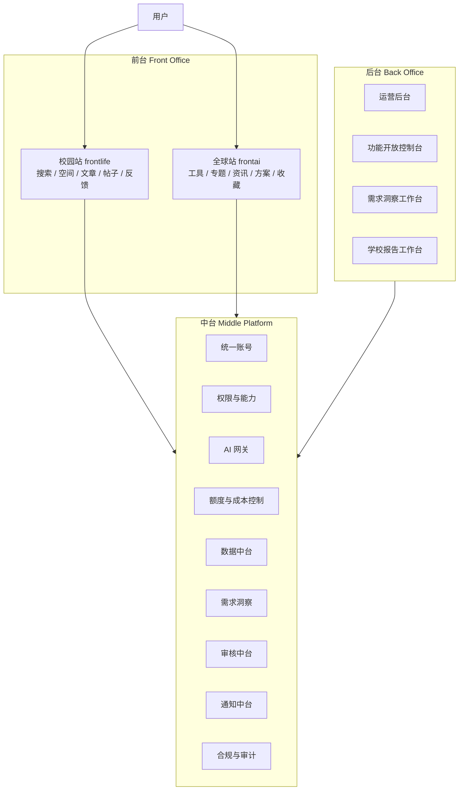

# 盘根架构设计

> 日期：2026-04-25  
> 依据：`specs/MISSION.md`、`specs/PRD-盘根校园-v9.md`、`specs/PRD-盘根AI指南针-标准版.md`  
> 定位：重新定义盘根的目标架构。本文先描述应然架构，不受当前实现难度限制。

## 0. 文档地位与旧稿关系

本文是当前目标架构的主文档。后续产品、研发、后台和数据设计如果与本文冲突，以本文为准。

旧会议纪要、旧研发计划和旧架构研讨稿已经从当前文档树清理，不再作为研发输入。旧稿中出现的“账号不互通”“用户表不共享”“用户名 + 邮箱注册为必选”等说法，已被本文的新裁定替换：

- 账号身份统一。
- 账号 LV 等级两站共享。
- 校园 profile、全球 profile、知识库和个人行为数据分开。
- 邮箱、手机号等联系方式作为后置绑定能力，不作为早期注册必选项。
- 跨域 Cookie/token 不直接共享；统一认证服务通过站点上下文识别同一个 account。

## 1. 一句话架构

盘根是一个 **统一账号与共享后端平台**，承载 **校园站** 和 **全球站** 两个独立产品。

- 校园站：沉淀可信校园生活知识，让 AI 无形地服务生活。
- 全球站：生成 AI 实践方案，让 AI 有形地成为能力。
- 中台：统一账号、AI、权限、额度、数据、审核、通知、合规和需求分析。
- 后台：运营、审核、配置、功能开放、报告生成和审计。



## 2. 架构原则

1. **账号共享，等级共享，产品分开**  
   同一个账号可以登录校园站和全球站；LV 等级属于账号级，两站打通；校园资料和全球站资料分开。

2. **后端共享，领域分开**  
   后端是一套共享平台能力，但校园站和全球站的业务领域模型不混用。

3. **知识库默认不共享**  
   校园知识库和全球 AI 知识库默认独立。只有公开、审核、去个人化、必要时经授权的内容，才允许从校园站单向同步为全球站案例。

4. **数据进中台，操作在后台**  
   前台产生数据，中台治理和分析数据，后台查看、审核、导出和决策。

5. **AI 受控，不替人决策**  
   AI 可以做搜索兜底、方案生成、摘要、需求洞察和建议，但不能自动发布、自动精选、自动改变产品规则。

6. **全量开发，分级开放**  
   功能可以全量开发，但上线使用通过后台功能开放控制台逐步开放。

## 3. 前台设计

前台是用户直接使用产品的地方。校园站和全球站保持独立体验。

### 3.1 校园站 frontlife

目标：让学生和老师快速得到可信校园答案，并把信息沉淀为空间。

核心能力：

- 搜索校园问题。
- 本地内容优先。
- AI 参考回答作为搜索的一部分，但受额度控制。
- 空间、文章、帖子、回复。
- 有帮助、有变化、求助。
- 我的内容、我的收藏、我的空间、帮助人数。
- 自然进入全球站的低权重触点。

校园站不应成为全球站广告页。全球站入口只在 AI 回答卡片和文章阅读完成后低存在感出现。

### 3.2 全球站 frontai

目标：帮助用户主动掌握 AI，围绕目标生成可执行方案。

核心能力：

- 工具发现。
- 专题、文章、资讯。
- AI 方案生成。
- 方案保存、导出、反馈有效性。
- 收藏工具和文章。
- 用户中心、额度、设置。

全球站不是普通工具目录，也不是资讯站。核心体验是“说出目标，得到方案”。

## 4. 中台设计

中台是盘根的共享能力层。它不直接服务某一个页面，而是支撑两个产品和后台。

```text
Middle Platform
├─ identity            统一账号
├─ level-policy        两站共享 LV 等级
├─ capability          权限与能力判断
├─ feature-flags       功能开关
├─ quota               额度与成本控制
├─ ai-gateway          AI 调用、过滤、日志
├─ search              搜索索引与查询
├─ event-store         行为事件
├─ insight-engine      需求分析
├─ report-engine       学校报告
├─ moderation          审核
├─ notification        站内通知、邮件、未来短信
├─ compliance          协议、隐私、数据导出、注销
└─ audit               操作审计
```

### 4.1 统一账号

早期注册采用最小身份：

```text
用户名 + 密码
```

不强制收集：

- 手机号
- 邮箱
- 真实姓名
- 身份证
- 学号
- 精确定位

但架构从第一天支持后置绑定：

- 邮箱绑定
- 手机号绑定
- GitHub OAuth
- 校园认证

账号等级是显性存在的两站共享等级。游客没有等级，注册后默认 LV1。LV 不属于某一个站点，而属于统一账号。

```text
Guest：游客，无 LV
LV1：注册用户
LV2：可信用户 / 作者
LV3：高级用户 / 维护者
Admin：管理员
```

LV 的展示可以出现在两个站的个人入口、用户中心或权限说明中。具体功能仍按站点映射，避免把两个产品的业务能力混在一起。

建议数据结构：

```text
Account
- id
- username
- globalLevel: guest / lv1 / lv2 / lv3 / admin
- status
- createdAt

Credential
- accountId
- type: password / email / phone / github
- identifierHash
- secretHash
- verifiedAt

CampusProfile
- accountId
- displayName
- school
- contributionStats
- permissions

CompassProfile
- accountId
- applicationStatus
- quota
- savedSolutions
- favorites

LevelChangeLog
- accountId
- fromLevel
- toLevel
- reason
- operatorId
- createdAt

Consent
- accountId
- product
- consentType
- version
- grantedAt
- revokedAt

PhoneBinding
- accountId
- encryptedPhone
- countryCode
- verifiedAt
- purpose
```

原则：账号逻辑统一，LV 等级两站共享，产品资料分开。

### 4.2 权限与能力

前台不直接判断用户能做什么。前台向中台查询能力。

LV 是账号级别，capability 是站点级权限映射。

```text
同一个 globalLevel = LV2

校园站能力：
- canPost
- canWriteArticle
- canUseLocalSync

全球站能力：
- canGenerateSolution
- canSaveSolution
- canExportSolution
- canSubmitContent
```

基础权限建议：

| 等级 | 账号状态 | 校园站能力 | 全球站能力 |
| --- | --- | --- | --- |
| Guest | 未注册 | 浏览、本地搜索、少量游客 AI | 浏览公开内容、少量游客 AI |
| LV1 | 注册用户 | 发短帖、有帮助、有变化、基础 AI 搜索 | 收藏、少量方案生成 |
| LV2 | 可信用户 / 作者 | 写长文章、AI 写作、本地文档同步、更高 AI 额度 | 保存/导出方案、内容投稿、本地文档同步 |
| LV3 | 高级用户 / 维护者 | 创建空间、认领空间、维护空间、处理变化反馈 | 高级内容工作室、工具/专题投稿、更高额度 |
| Admin | 管理员 | 后台与审核能力 | 后台与审核能力 |

示例：

```http
GET /api/platform/capabilities?site=campus
```

返回：

```json
{
  "level": "LV1",
  "canSearch": true,
  "canUseAiSearch": true,
  "aiSearchRemaining": 1,
  "canRegister": true,
  "canPost": false,
  "canWriteArticle": false,
  "canCreateSpace": false
}
```

能力由三类规则共同决定：

- 账号 LV 等级
- 产品 profile
- 后台 feature flag 和 launch preset

### 4.3 AI 网关

AI 网关是所有 AI 调用的唯一入口。前端不能直接持有模型 key，也不能直接决定调用模型。

AI 网关职责：

- 输入敏感词检查。
- 本地搜索优先。
- quota 检查。
- prompt 组装。
- provider 调用。
- 输出过滤。
- fallback reason 标准化。
- 成本和 token 记录。
- 调用日志审计。

校园 AI 搜索流程：

```text
用户搜索
  -> 本地搜索
  -> 有足够结果：返回本地内容
  -> 结果不足：检查 AI 权限、额度、限流、敏感词
  -> 允许：生成 AI 参考回答
  -> 不允许：展示相关内容、登录/邀请提示、发起求助
```

游客可以搜索，但 AI 次数必须有限。早期建议：

| 用户类型 | 本地搜索 | AI 搜索 |
| --- | --- | --- |
| 游客 | 开放 | 每天 1 到 2 次 |
| LV1 | 开放 | 每天 5 到 10 次 |
| LV2 | 开放 | 更高额度 |
| LV3 | 开放 | 更高额度和写作能力 |

### 4.4 数据中台

平台数据属于中台。

- 前台产生数据。
- 中台采集、清洗、治理、聚合、分析数据。
- 后台查看、配置、审核和导出数据。

数据分三类：

```text
Operational DB
- 账号
- 内容
- 方案
- 审核
- 通知
- 额度

Event Store
- 搜索
- 点击
- 阅读
- 有帮助
- 有变化
- 发帖
- 方案生成
- 方案保存

Derived Store
- 洞察
- 趋势
- 报表
- 推荐依据
- 内容任务建议
```

### 4.5 需求洞察

需求分析是中台能力，后台使用，前台产生数据。

```text
前台行为
  -> Event Collector
  -> Event Store
  -> Aggregator
  -> AI Analyzer
  -> Insight Store
  -> Action Queue
  -> 后台人工确认
```

采集事件：

- 搜索词
- 无结果搜索
- AI 兜底
- 文章阅读
- 有帮助
- 有变化
- 帖子发布
- 空间访问
- 方案生成
- 方案保存
- 工具点击
- 跨站跳转

洞察不只是图表，而是行动建议：

```text
洞察：过去 7 天“宿舍水压”无结果搜索 43 次
证据：query 聚类 + 有变化反馈 + 回复增长
建议：创建“宿舍水压解决办法”内容任务
对象：校园运营 / 相关空间维护者
优先级：高
```

AI 只生成洞察和建议，不直接改变前台。

### 4.6 学校报告

学校报告属于：

- 中台：Report Engine / Insight Engine
- 后台：School Report Workbench

不属于校园站前台。

报告只能使用脱敏聚合数据，不能输出个人行为轨迹。

允许输出：

- 高频需求变化。
- 校园信息覆盖情况。
- 活动和通知触达情况。
- 空间访问趋势。
- 内容更新情况。
- AI 兜底下降趋势。

禁止输出：

- 个人用户。
- 个人搜索记录。
- 个人发帖轨迹。
- 个人画像。
- 未公开敏感内容。

## 5. 后台设计

后台是团队运营和控制系统。

```text
Back Office
├─ 运营后台
├─ 审核队列
├─ 内容管理
├─ 用户管理
├─ AI 调用与额度
├─ 需求洞察工作台
├─ 学校报告工作台
├─ 功能开放控制台
├─ 通知投递
├─ 数据导出和注销处理
└─ 审计日志
```

### 5.1 运营后台

运营后台负责：

- 用户管理。
- 校园空间和内容管理。
- 全球工具、专题、资讯管理。
- 申请审核。
- 举报和内容审核。
- AI 输出抽检。
- 通知投递。
- 数据导出和注销处理。
- 审计追踪。

后台入口统一，但所有数据按站点、角色、权限过滤。

### 5.2 需求洞察工作台

需求洞察工作台展示：

- 高频需求。
- 内容空白。
- 过期内容。
- AI 兜底过高问题。
- 全球站方案失败点。
- 工具点击趋势。
- 校园到全球自然转化。
- AI 生成的内容任务建议。

后台人员确认后，才可以：

- 创建内容任务。
- 通知空间维护者。
- 调整推荐配置。
- 生成学校报告。

### 5.3 功能开放控制台

全量功能可以开发完成，但上线开放由后台控制。

功能开放控制台包含：

- 阶段开放按钮。
- 单功能开关。
- 人群开关。
- AI 额度配置。
- 成本熔断。
- 注册熔断。
- 发帖熔断。
- 一键回滚。

示例阶段：

```text
Phase 0：内部测试
- 只允许测试账号
- AI 不对游客开放

Phase 1：校园搜索开放
- 游客可本地搜索
- 游客每天 1 次 AI
- 不开放发帖

Phase 2：校园互动开放
- 开放用户名注册
- 注册用户默认 LV1
- 开放短帖
- 开放有帮助/有变化
- 开启审核队列

Phase 3：内容共建开放
- 开放 LV2 长文章
- 开放 LV2 本地文档同步
- 开放 LV3 空间创建
- 开放 LV3 空间认领

Phase 4：全球站 Beta
- 申请制或邀请制
- 工具浏览
- 方案生成
- 方案保存
- LV2 开放方案导出和内容投稿
- LV3 开放高级内容工作室

Phase 5：正式开放
- 注册开放
- 配额体系完整
- LV 升级策略完整
- 手机号绑定可选
```

每个开放按钮都必须做依赖检查。

例如开放游客 AI 搜索前必须满足：

- AI 网关已配置。
- 敏感词过滤已开启。
- 游客额度已配置。
- AI 调用日志已开启。
- fallback 文案已配置。
- 成本上限已配置。

## 6. 业务领域

### 6.1 Campus Domain

校园领域负责可信校园信息。

```text
Campus Domain
├─ spaces
├─ articles
├─ posts
├─ replies
├─ feedbacks
├─ claims
├─ campus search
└─ campus reputation
```

信任来源：

- 本地内容。
- 有帮助。
- 有变化。
- 空间维护者。
- 更新时间。
- 审核记录。
- 账号 LV 等级。

校园站不以 AI 为主角。AI 是空气，是辅助。

### 6.2 Compass Domain

全球领域负责 AI 工具和实践方案。

```text
Compass Domain
├─ tools
├─ topics
├─ articles
├─ news
├─ solutions
├─ favorites
├─ quota
└─ compass search
```

信任来源：

- 平台审核。
- 工具资料完整度。
- 方案保存率。
- 方案有效率。
- 用户反馈。
- 内容质量分析。
- 账号 LV 等级。

全球站以 AI 能力为显性价值，但 AI 仍不替用户做最终决定。

## 7. 数据共享边界

共享：

- 账号身份。
- 账号 LV 等级。
- 统一登录能力和账号会话状态。
- feature flag。
- quota 策略。
- AI 网关能力。
- 审核能力。
- 通知能力。
- 脱敏行为事件。
- 聚合需求洞察。

不默认共享：

- 校园知识库。
- 全球工具知识库。
- 校园用户身份资料。
- 全球站方案详情。
- 个人搜索记录。
- 跨域 Cookie/token。
- 手机号、邮箱等身份信息。

允许有限同步：

- cn -> com 单向。
- 公开内容。
- 审核通过。
- 去个人化。
- 必要时作者授权。
- 作为全球站案例或内容素材。

不做：

- com -> cn 自动内容同步。
- 用全球站内容自动改校园站推荐。
- 把校园个人数据用于全球站个性化。
- 把用户原始隐私数据直接交给 AI 分析。

## 8. 推荐 API 分层

```text
/api/identity/*
/api/platform/*
/api/campus/*
/api/compass/*
/api/ai/*
/api/analytics/*
/api/insights/*
/api/moderation/*
/api/notification/*
/api/compliance/*
/api/admin/*
```

前台调用产品 API：

- 校园站主要调用 `/api/campus/*` 和必要的平台能力。
- 全球站主要调用 `/api/compass/*` 和必要的平台能力。

后台调用 admin API：

- 审核。
- 配置。
- 洞察。
- 报告。
- 用户管理。
- 审计。

## 9. 部署与数据驻留

早期如果面向国内用户并使用国内服务器，应默认：

- 数据存储在国内。
- 不收手机号、实名、身份证、学号。
- 注册最小化。
- AI 需求分析只读脱敏事件和聚合指标。
- 不把 cn 原始用户数据发到海外。

未来全球站海外化时，应支持：

```text
cn operational db
com operational db
shared platform config
event aggregation with boundary
derived insight without raw identity
```

逻辑上统一账号，物理上允许按区域拆 identity store 和 product profile。

## 10. 关键结论

1. 盘根不是一个大站拆成两个页面，而是两个产品共享一个平台。
2. 前台分产品，中台分能力，后台分工作台。
3. 账号和 LV 等级共享，但校园 profile 和全球 profile 分开。
4. AI 搜索是搜索的一部分，但成本控制在中台。
5. 需求分析属于中台，使用入口在后台。
6. 学校报告属于中台报告引擎和后台报告工作台，不进入前台。
7. 功能开放不是写死阶段，而是后台按钮控制中台策略。
8. AI 只能提出建议，不能直接替人发布、精选、改规则。
